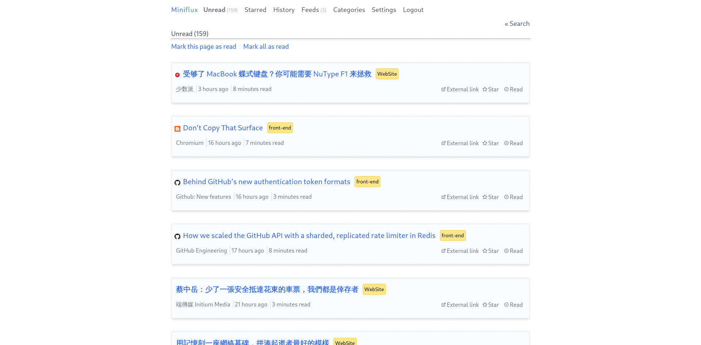

A custom CSS for **[Miniflux v2](https://github.com/miniflux/v2)**

This is a modification from the original CSS. Adjusted some layout and colors.

这是从原来的 CSS 的基础上修改的。调整了一些布局和颜色。

# Usage

Copy Paste [This file](https://github.com/fengkx/miniflux-theme-pure/tree/master/dist/style.css) to Your Miniflux Settings Custom CSS

Or You can choose the [minify version](https://github.com/fengkx/miniflux-theme-pure/tree/master/dist/style.min.css).

# Screenshots

